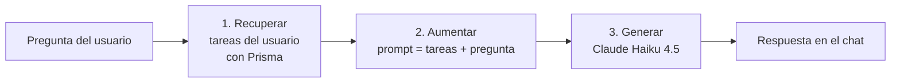

# Gestor de tareas con RAG y LLM

Aplicación full stack con un **asistente de IA que responde preguntas sobre tus propias tareas**. El backend recupera las tareas del usuario desde PostgreSQL, las incorpora al prompt como contexto y le pide a Claude que responda basándose solo en ellas.

Preguntas que puedes hacerle, por ejemplo:

- «¿Qué me queda pendiente?»
- «¿Cuántas tareas tengo completadas?»
- «¿Por cuál me recomiendas empezar?»

## Cómo funciona el RAG

RAG (*Retrieval-Augmented Generation*) consiste en darle al modelo información que no conoce, recuperada justo antes de preguntarle. En este proyecto el flujo de `POST /chat` tiene tres pasos:



1. **Recuperar.** Se consultan en PostgreSQL las tareas del usuario autenticado (`prisma.tarea.findMany` filtrando por `usuarioId`).
2. **Aumentar.** Las tareas se formatean como una lista de texto (`- título (completada | pendiente)`) y se unen a la pregunta en un único prompt.
3. **Generar.** El prompt se envía a la API de Anthropic (`claude-haiku-4-5`) y la respuesta vuelve al frontend.

El código está en [`backend/src/controllers/chat.controller.ts`](backend/src/controllers/chat.controller.ts).

### Decisiones de diseño

- **Aislamiento por usuario.** El `usuarioId` sale del token JWT (cookie HttpOnly), nunca del cuerpo de la petición. Un usuario no puede hacer que el modelo vea las tareas de otro.
- **La API key nunca llega al navegador.** La llamada al modelo se hace solo desde el backend; el frontend solo habla con `/chat`.
- **Modelo pequeño y rápido.** Se usa Haiku por su coste y latencia, suficientes para responder sobre una lista corta de tareas.
- **Contexto = datos reales.** Las respuestas se apoyan en el contenido actual de la base de datos, no en lo que el modelo «recuerda».

### Qué es y qué no es (limitaciones)

Es un RAG **básico**, y conviene decirlo con claridad:

- **No hay búsqueda semántica.** No se usan embeddings ni base de datos vectorial. La recuperación es una consulta SQL que trae **todas** las tareas del usuario, sin ranking ni selección por relevancia.
- **El contexto crece con los datos.** Con muchas tareas el prompt se haría largo y caro. Hoy no hay límite ni paginación.
- **Sin memoria de conversación.** Cada pregunta se envía de forma independiente; el modelo no ve los mensajes anteriores.
- **Sin instrucciones de sistema.** No hay un *system prompt* que fije el tono ni limite las respuestas al contexto proporcionado.
- **Respuesta completa, sin streaming.** El frontend espera a que el modelo termine.

### Posibles mejoras

- Guardar un embedding por tarea (por ejemplo con `pgvector`) y recuperar solo las más relevantes para la pregunta.
- Añadir un *system prompt* y mantener el historial de la conversación.
- Respuestas en streaming.
- Limitar el número de tareas enviadas y medir el coste por petición.
- Evaluar la calidad de las respuestas con un conjunto de preguntas de prueba.

## Stack

- **IA:** API de Anthropic (Claude Haiku 4.5), SDK oficial `@anthropic-ai/sdk`
- **Backend:** Node.js, Express, TypeScript
- **Base de datos:** PostgreSQL (Neon) con Prisma
- **Autenticación:** JWT en cookie HttpOnly, contraseñas con bcrypt
- **Frontend:** Next.js (App Router), React, TypeScript, Tailwind CSS
- **Infraestructura:** Docker y Docker Compose

## Funcionalidades

- Registro, inicio y cierre de sesión.
- Crear, completar, desmarcar y borrar tareas.
- Chat con IA sobre las tareas del usuario.
- Cada usuario solo ve y modifica sus propias tareas.

## Estructura

```
.
├── backend/              API con Express + Prisma (incluye el endpoint /chat)
├── nextjs/               Frontend con Next.js
└── docker-compose.yml    Levanta backend y frontend juntos
```

## Requisitos

- [Docker Desktop](https://www.docker.com/products/docker-desktop/)
- Una base de datos PostgreSQL (por ejemplo, un proyecto gratuito en [Neon](https://neon.tech))
- Una API key de Anthropic, desde [console.anthropic.com](https://console.anthropic.com)

## Puesta en marcha

1. Copia las variables de entorno del backend y rellena tus valores:

   ```
   cp backend/.env.example backend/.env
   ```

   En Windows (PowerShell): `Copy-Item backend\.env.example backend\.env`

   | Variable            | Para qué sirve                                    |
   | ------------------- | ------------------------------------------------- |
   | `DATABASE_URL`      | Cadena de conexión a PostgreSQL                   |
   | `JWT_SECRET`        | Secreto con el que se firman los tokens           |
   | `ANTHROPIC_API_KEY` | API key de Anthropic, usada por el endpoint /chat |

2. Levanta todo con un solo comando:

   ```
   docker compose up --build
   ```

3. Abre la aplicación:

   - Frontend: http://localhost:3001
   - Backend: http://localhost:3000

4. Para parar los contenedores:

   ```
   docker compose down
   ```

## Cómo funciona con Docker

- Cada servicio (`backend` y `frontend`) tiene su propio `Dockerfile` y su `.dockerignore`.
- Compose los conecta en una red interna. Desde el contenedor del frontend, el backend es accesible como `http://backend:3000`; el frontend lo recibe en la variable de entorno `API_URL`.
- Los `fetch` que ejecuta el navegador (login, tareas, chat) usan la variable `NEXT_PUBLIC_API_URL` y, si no está definida, `http://localhost:3000`, porque el backend publica ese puerto en tu máquina.
- El archivo `.env` nunca entra en la imagen: se inyecta al arrancar el contenedor con `env_file`.

## Endpoints del backend

| Método | Ruta          | Protegida | Descripción                                          |
| ------ | ------------- | --------- | ---------------------------------------------------- |
| POST   | `/registro`   | No        | Crea un usuario                                      |
| POST   | `/login`      | No        | Inicia sesión y guarda el token en cookie            |
| POST   | `/logout`     | No        | Cierra sesión y borra la cookie                      |
| GET    | `/tareas`     | Sí        | Lista las tareas del usuario logueado                |
| POST   | `/tareas`     | Sí        | Crea una tarea para el usuario logueado              |
| PUT    | `/tareas/:id` | Sí        | Actualiza una tarea (solo si es tuya)                |
| DELETE | `/tareas/:id` | Sí        | Elimina una tarea (solo si es tuya)                  |
| POST   | `/chat`       | Sí        | Pregunta a la IA sobre tus tareas (`{ "pregunta" }`) |
| GET    | `/usuarios`   | Sí        | Lista los usuarios (sin contraseñas)                 |

## Desarrollo sin Docker

Cada carpeta se puede arrancar por separado (con las dependencias instaladas y el `.env` del backend configurado):

```
# backend (puerto 3000)
cd backend
npm install
npx prisma generate
npm run dev

# frontend (puerto 3001)
cd nextjs
npm install
npm run dev
```

Para cambiar la dirección del backend en el frontend, crea `nextjs/.env.local` con `NEXT_PUBLIC_API_URL=http://localhost:3000`.

El script `dev` del frontend usa `--webpack` para evitar un problema con Turbopack en el entorno de desarrollo.

## Modelo de datos

Cada tarea pertenece a un usuario (`Tarea.usuarioId`, relación con `Usuario`). `/tareas` y `/chat` filtran siempre por el usuario del token, y `PUT`/`DELETE` comprueban que la tarea sea suya.
